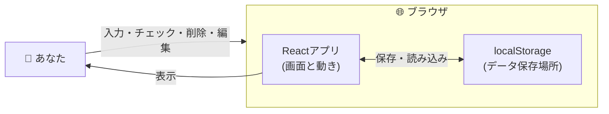
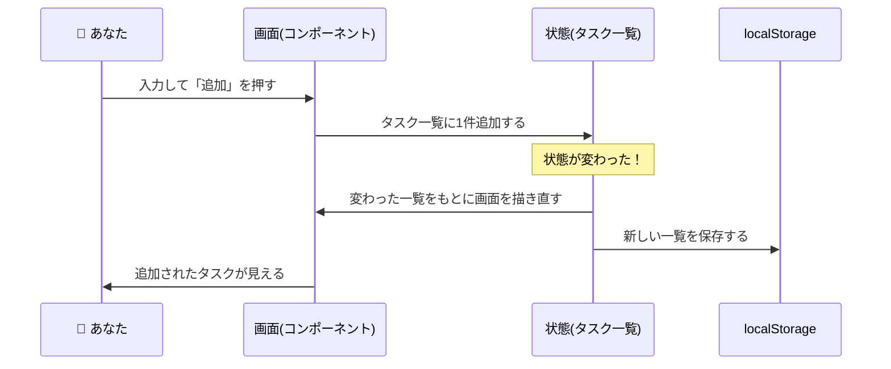

# 02. アーキテクチャ — どう組み立てるか

## 1. 技術スタック

このプロジェクトにセットアップ済みの技術を使う。

| 技術             | 役割                                                               |
| ---------------- | ------------------------------------------------------------------ |
| **HTML**         | 画面の構造                                                         |
| **CSS**          | 画面の見た目（色・配置）                                           |
| **TypeScript**   | アプリの動作記述（JavaScript + 型）                                |
| **React**        | 画面を部品（コンポーネント）に分けて構築。表示とデータの連動が得意 |
| **Vite+**        | 開発サーバー・ビルド・チェックの統合ツール（`vp` コマンド）        |
| **localStorage** | データのブラウザ内保存                                             |

Reactを採用する理由は、TODOアプリが **データが変わると画面も変わる** タイプのアプリ（タスク追加で表示が増える、チェックで見た目が変わる）であり、「データを変えれば画面が自動で描き直される」Reactと相性が良いため。

## 2. 全体構成

サーバーを使わず、ブラウザ内で完結する構成。**この図はフェーズ1 のもの**で、フェーズ2（サーバー・DB連携）の構成は [06](./06-backend-architecture.md) に描く。

登場するのは **「あなた」「Reactアプリ」「localStorage」の3つだけ**。

## 3. データの流れ

このアプリの中心は **状態（state）** で、その中身は **「タスク一覧」**。Reactの基本原則は次の1点。

> **状態が変わる → 画面が自動で描き直される**

そのため画面を直接書き換えるのではなく、**状態を変える**ことで画面を更新する。「タスクを追加」する場合の流れは次のとおり。

完了チェック・削除・編集も同様に、すべての操作が **「状態を変える → 画面が変わる → localStorageに保存する」** の流れとなる。

## 4. 状態管理の方針

状態は「タスク一覧」の **1つだけ**。削除・編集が増えても変更対象は同じ一覧のため、状態は1つのまま。

- タスク一覧は React 標準の **`useState`** で保持する
- localStorageへの保存・読み込みは1か所（`useTodos`）に集約する（[04](./04-ui-and-components.md)・[05](./05-directory-and-steps.md)）

状態管理ライブラリ（Reduxなど）は使わない。状態が1つと小さく、標準の `useState` で十分なため。

## まとめ

- サーバーなし。登場人物は「あなた・Reactアプリ・localStorage」の3つ
- 中心は **状態（タスク一覧）**。状態を変えれば画面は自動で更新される
- 追加・完了チェック・削除・編集は、すべて **「状態を変える → 画面が変わる → 保存する」**
- 状態管理は `useState`。大きなライブラリは使わない
- フェーズ2 では localStorage の席にサーバー（Hono + D1）が入る。§3・§4 の原則はそのまま変わらない（[06](./06-backend-architecture.md)）
