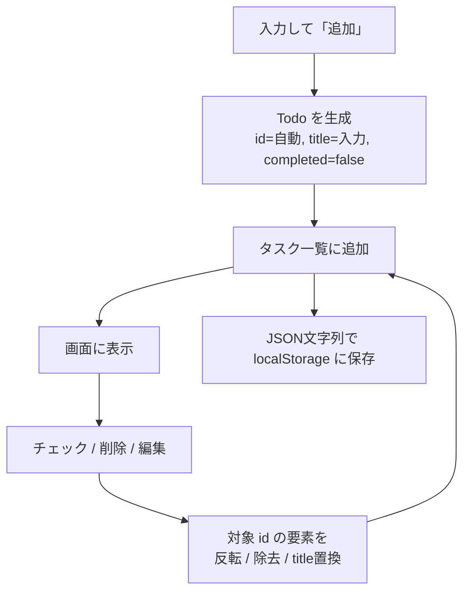

# 03. データモデル — タスクのデータ構造と永続化

## 1. タスク1件のデータ項目

要件（[01](./01-requirements.md)）の5機能に必要な項目だけを持つ。期限・カテゴリなどはスコープ外のため持たない。

| 項目        | 意味                                 | 型        | 例               |
| ----------- | ------------------------------------ | --------- | ---------------- |
| `id`        | タスクを一意に識別する目印           | `string`  | `"3f2504e0-..."` |
| `title`     | タスクの内容（編集で書き換える対象） | `string`  | `"牛乳を買う"`   |
| `completed` | 完了しているか                       | `boolean` | `false`          |

`id` は、同じ `title` のタスクがあっても1件ずつを区別し、完了切り替え・削除・編集の対象を特定するために使う。生成にはブラウザ標準の `crypto.randomUUID()` を用いる。フェーズ2 では採番がサーバー側に移る（[07](./07-db-schema.md) §2）。

## 2. 型定義

```ts
// タスク1件
export type Todo = {
  id: string; // 識別子（生成: crypto.randomUUID()）
  title: string; // タスクの内容
  completed: boolean; // 完了なら true
};
```

タスク一覧は、この `Todo` を並べた配列 `Todo[]` で表す。各操作が状態（`Todo[]`）に対して何をするか：

| 操作                | 状態への変更                                    |
| ------------------- | ----------------------------------------------- |
| 追加（F-1）         | 新しい `Todo`（`completed: false`）を配列に足す |
| 完了チェック（F-3） | 対象 `id` の `completed` を反転する             |
| 削除（F-4）         | 対象 `id` の要素を配列から取り除く              |
| 編集（F-5）         | 対象 `id` の `title` を新しい文字列に置き換える |

## 3. 永続化（localStorage）

これは **フェーズ1 の方式**。フェーズ2 では保存先を D1（サーバー側の SQLite）に置き換える（[07](./07-db-schema.md)）。

localStorageは文字列しか保存できないため、JSONに変換して読み書きする。保存キーは `"todos"` とする。

```ts
// 保存
localStorage.setItem("todos", JSON.stringify(todos));

// 読み込み（未保存なら空配列）
const saved = localStorage.getItem("todos");
const todos: Todo[] = saved ? JSON.parse(saved) : [];
```

タスク一覧が変わるたびに保存する方針とし、この読み書きは `useTodos`（[05](./05-directory-and-steps.md)）に集約する。

保存データが壊れている場合（JSON として解釈できない・配列でない）は、例外で画面が表示できなくなるのを避けるため**空配列にフォールバック**する。壊れたデータは復旧せず、次の保存で上書きされる。

## 4. データのライフサイクル



## まとめ

- タスク1件は `id` / `title` / `completed`（型名 `Todo`）、一覧は `Todo[]`
- `id` は `crypto.randomUUID()` で採番し、完了・削除・編集の対象特定に使う
- 各操作は `Todo[]` への「追加・反転・除去・title置換」で表現する
- localStorageへはJSON文字列（キー `"todos"`）で永続化する（フェーズ1）。フェーズ2 では D1 に置き換える（[07](./07-db-schema.md)）
