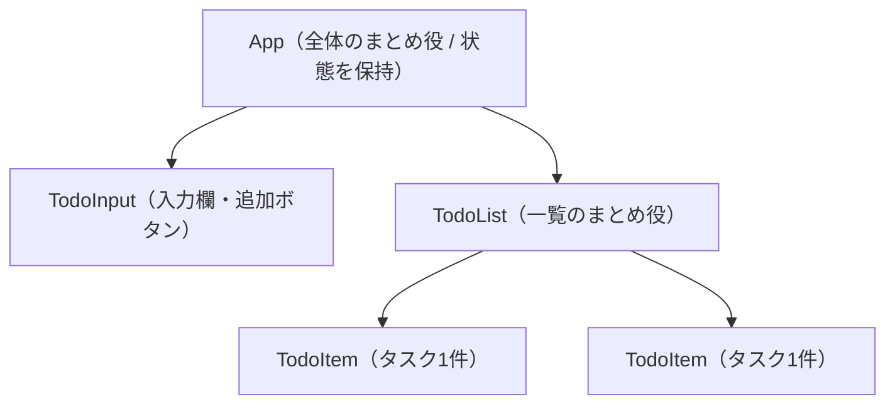
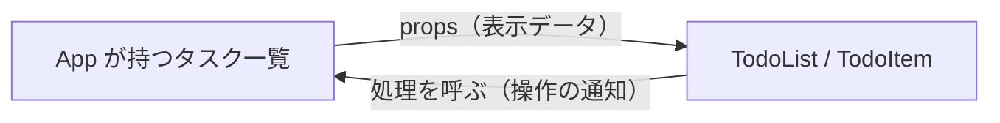

# 04. 画面設計とコンポーネント設計

## 1. 画面レイアウト（ワイヤーフレーム）

画面は1画面のみ。

```
┌──────────────────────────────────────┐
│               My TODO                │  ← タイトル
├──────────────────────────────────────┤
│ [ タスクを入力...        ] [追加]     │  ← 入力欄 + 追加ボタン
├──────────────────────────────────────┤
│ ☐  牛乳を買う              [編集][削除] │  ← タスク1件
│ ☑  部屋を掃除する (打消線)  [編集][削除] │  ← 完了タスク
│ ☐  レポートを書く          [編集][削除] │
└──────────────────────────────────────┘
```

- 上からタイトル → 入力欄＋追加ボタン → タスク一覧
- 各タスク行に、チェックボックス／内容／編集・削除の操作
- 完了タスクは打ち消し線で表現
- 0件のときは「タスクがありません」を表示
- 編集時は、その行の内容を入力欄に切り替えて確定できるようにする

## 2. コンポーネント構成

画面を4つの部品に分割する。1部品が1つの役割を持つ形にして、読みやすく・直しやすくする。



`TodoItem` は同じ形をタスクの数だけ繰り返し使う。

## 3. 各コンポーネントの責務

| 部品          | 役割                                                       | 受け取るもの（props）                  | 呼び出す操作                              |
| ------------- | ---------------------------------------------------------- | -------------------------------------- | ----------------------------------------- |
| **App**       | 全体のまとめ役。**タスク一覧の状態を保持**し、各操作を提供 | なし                                   | —                                         |
| **TodoInput** | 入力欄と追加ボタン                                         | 追加処理                               | 追加（F-1）                               |
| **TodoList**  | 一覧のまとめ役。数だけ `TodoItem` を並べ、0件時は案内表示  | タスク一覧、完了切替・削除・編集の処理 | —                                         |
| **TodoItem**  | タスク1件の表示と操作                                      | タスク1件、完了切替・削除・編集の処理  | 完了切替（F-3）・削除（F-4）・編集（F-5） |

## 4. データと操作の流れ（props方針）

- **データは上から下へ**：状態は `App` が持ち、子には props で配って表示させる
- **操作は下から上へ**：子で起きた操作（追加・完了切替・削除・編集）は、親から渡された処理を呼んで、親に状態を変えてもらう



状態を持つのは `App` だけ、という役割分担により「今どんなデータか」を1か所（App）で把握できる。

## 5. 状態の置き場所

タスク一覧は `TodoInput`（追加）も `TodoList`（表示・操作）も使う共通データのため、両者の共通の親である **`App` が保持**する。
なお `App` は localStorage を直接触らず、状態の保持と保存を `useTodos`（[05](./05-directory-and-steps.md)）に委譲し、画面の組み立てに専念する。

## まとめ

- 画面は1つ（タイトル／入力欄／一覧）。各行に完了・編集・削除の操作を置く
- 部品は **App / TodoInput / TodoList / TodoItem** の4つ
- **状態を持つのは App だけ**。データは上から下、操作は下から上
- 保存の詳細は `useTodos` に切り出す
