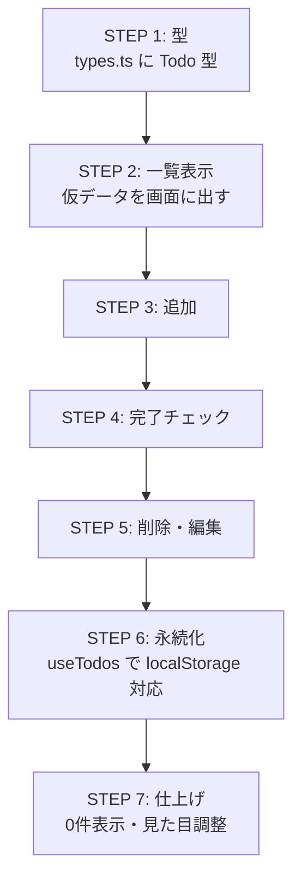

# 05. ディレクトリ構成と実装の進め方

## 1. ディレクトリ構成

`src` の中身が今回の実装対象。

```
todo-app/
├── docs/                    ← 設計ドキュメント
└── src/
    ├── main.tsx             ← 起動エントリ（用意済み）
    ├── App.tsx              ← 全体のまとめ役コンポーネント
    ├── style.css            ← 見た目（CSS）
    ├── types.ts             ← Todo 型
    ├── hooks/
    │   └── useTodos.ts      ← 状態保持 + localStorage 保存 + 各操作
    └── components/
        ├── TodoInput.tsx    ← 入力欄・追加ボタン
        ├── TodoList.tsx     ← 一覧のまとめ役
        └── TodoItem.tsx     ← タスク1件（完了・編集・削除）
```

役割ごとにフォルダを分け（部品は `components/`、状態の仕組みは `hooks/`）、型は `types.ts` に集約する。

## 2. 各ファイルの役割

| ファイル                   | 役割                                                                               | 対応する設計                                          |
| -------------------------- | ---------------------------------------------------------------------------------- | ----------------------------------------------------- |
| `types.ts`                 | `Todo` 型の定義                                                                    | [03](./03-data-model.md)                              |
| `hooks/useTodos.ts`        | タスク一覧の状態保持、localStorageへの保存、追加・完了切替・削除・編集の処理を提供 | [02](./02-architecture.md) / [03](./03-data-model.md) |
| `App.tsx`                  | `useTodos` を使い、各部品を組み立てる                                              | [04](./04-ui-and-components.md)                       |
| `components/TodoInput.tsx` | 入力欄と追加ボタン                                                                 | [04](./04-ui-and-components.md)                       |
| `components/TodoList.tsx`  | `TodoItem` を並べる。0件時は案内表示                                               | [04](./04-ui-and-components.md)                       |
| `components/TodoItem.tsx`  | タスク1件の表示、完了切替・編集・削除                                              | [04](./04-ui-and-components.md)                       |
| `style.css`                | 見た目（打ち消し線など）                                                           | [04](./04-ui-and-components.md)                       |

## 3. 実装ルール

全STEP共通で守る方針。

- **小さく作って動かして確認**：機能を1つ作るごとに動かして確認し、土台から順に進める
- **実装とテストはセット**：実装したコードには対応するテストコードを必ず併せて書く。`vp test` が通って初めてそのSTEPを完了とする

## 4. 実装ステップ



| STEP | 内容                                                      | 併せて書くテスト                                                | 対応要件  |
| ---- | --------------------------------------------------------- | --------------------------------------------------------------- | --------- |
| 1    | `types.ts` に `Todo` 型を定義                             | —（型定義のみ）                                                 | —         |
| 2    | 仮データを `TodoList` / `TodoItem` で表示                 | 渡したタスクが表示される／0件時に案内が出る                     | F-2       |
| 3    | `TodoInput` で追加。空文字は不可                          | 追加で件数が増える／空文字は追加されない                        | F-1       |
| 4    | チェックで `completed` 切替、完了は打消線                 | 対象の `completed` が反転する                                   | F-3       |
| 5    | 削除ボタンで除去、編集で `title` を書き換え（空文字不可） | 削除で対象が消える／編集で `title` が変わる／空文字にはできない | F-4 / F-5 |
| 6    | 状態と保存を `useTodos` に集約、再読込でも残す            | 保存後に読み込むと一覧が復元される                              | 永続化    |
| 7    | 0件時の案内、`style.css` で見た目調整                     | 0件時の表示（STEP2のテストで担保）                              | F-2       |

各STEPの終わりに `vp test`（テスト）と `vp dev`（ブラウザ確認）の両方を行う。

## 5. 検証コマンド

| コマンド   | 内容                               |
| ---------- | ---------------------------------- |
| `vp dev`   | 開発サーバーを起動しブラウザで確認 |
| `vp check` | 整形・Lint・型チェック             |
| `vp test`  | テスト実行                         |

最初に `vp install` → `vp dev` で開始する。環境に不調があれば `vp env doctor`。

## 6. 完成チェックリスト

[01 の機能要件](./01-requirements.md#3-機能要件) との対応：

- [ ] 文字を入力して追加すると一覧に増える（F-1）
- [ ] 空文字では追加できない（F-1）
- [ ] 追加済みタスクがすべて表示される（F-2）
- [ ] 0件のとき案内が表示される（F-2）
- [ ] チェックで完了／未完了が切り替わり、見た目が変わる（F-3）
- [ ] 削除でタスクが一覧から消える（F-4）
- [ ] 編集で内容を書き換えられる。空文字にはできない（F-5）
- [ ] 再読み込みしてもタスクが残る（永続化）
- [ ] 各機能にテストコードがあり、`vp test` が通る

## 7. 今後の拡張（今回のスコープ外）

- 絞り込み（未完了だけ表示など）
- 期限・優先度・カテゴリ（`Todo` 型に項目追加）
- **サーバー・DBへの保存（次フェーズ）**：localStorageを置き換え、[02](./02-architecture.md) の構成を拡張する
