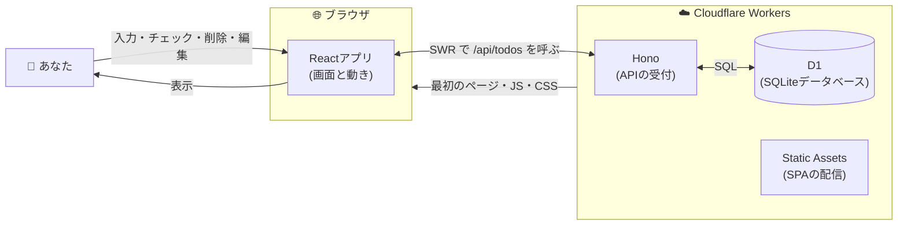
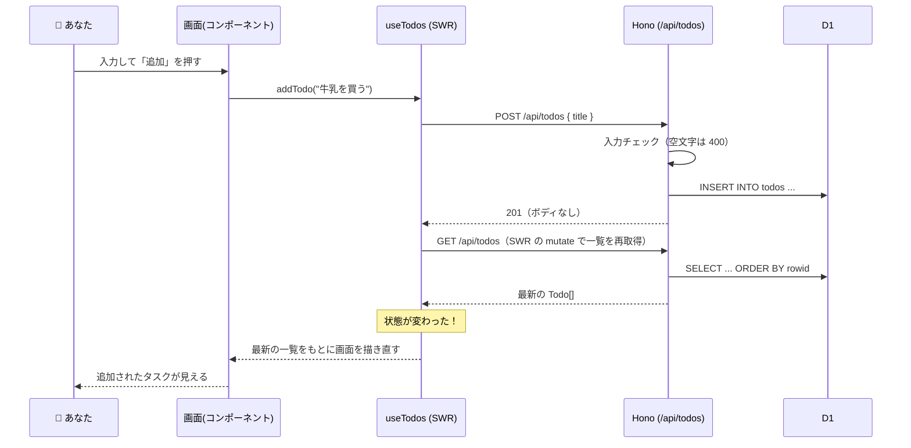

# 06. バックエンドアーキテクチャ — サーバーとDBをどう組み立てるか

フェーズ2 の全体構成を決める。フェーズ1 のアーキテクチャ（[02](./02-architecture.md)）と対比しながら読むと分かりやすい。

## 1. フェーズ2 でやること

**保存先を localStorage から、サーバー側のデータベース（D1）に置き換える**。これにより「別のブラウザ・別の端末から開いても同じタスク一覧が見える」ようになる。

大事なのは、**変わるのは保存の仕組みだけ**で、アプリの機能や画面は変わらないこと。

| 変わるもの                                                             | 変わらないもの                                              |
| ---------------------------------------------------------------------- | ----------------------------------------------------------- |
| 保存先：localStorage → D1（サーバー側の SQLite）                       | 5つの機能（追加・一覧・完了チェック・削除・編集）           |
| `useTodos` の中身：localStorage の読み書き → SWR を使った API 呼び出し | 画面・コンポーネント（`App` / `TodoInput` / `TodoList` 等） |
| `id` の採番場所：フロント → サーバー（[07](./07-db-schema.md)）        | 「状態を変える → 画面が自動で描き直される」という原則       |

コンポーネントを変えずに済むのは、フェーズ1 で保存の詳細を `useTodos` の1か所に隠しておいたから（[02](./02-architecture.md) §4）。この設計の効果をフェーズ2 で実感できる。

## 2. 技術スタック

| 技術                   | 役割                                                                                     | 理由                                                                                                                                                                                   |
| ---------------------- | ---------------------------------------------------------------------------------------- | -------------------------------------------------------------------------------------------------------------------------------------------------------------------------------------- |
| **Hono**               | Workers 上で動く軽量な Web フレームワーク（API の受付）                                  | ルーティング（URL と処理の対応付け）の書き方が素直で、学習に向く。Workers と相性が良い                                                                                                 |
| **Cloudflare Workers** | サーバー側コードの実行環境                                                               | 雛形が導入済み。SPA と API を1つのプロジェクト・1回のデプロイで動かせる                                                                                                                |
| **D1**                 | Workers に組み込みの SQLite データベース                                                 | 別のデータベースサーバーを立てずに済む。SQL は標準的な SQLite なので、学んだことが他でも通用する                                                                                       |
| **SWR**                | フロントのデータ取得ライブラリ（[https://swr.vercel.app/ja](https://swr.vercel.app/ja)） | 取得結果をキャッシュして無駄な通信を抑えられる。読み込み中（`isLoading`）・エラー（`error`）の状態や、操作後にキャッシュを無効化して一覧を取り直す仕組み（`mutate`）が標準で揃っている |

決めごと：

| 項目                                 | 決めたこと                                                | 理由                                                                                                                                                                   |
| ------------------------------------ | --------------------------------------------------------- | ---------------------------------------------------------------------------------------------------------------------------------------------------------------------- |
| ORM（Drizzle など）                  | 使わない。生の SQL で D1 を操作する                       | SQL そのものを学ぶことが目的の1つ。テーブル1つのアプリに ORM（SQL を自動生成する層）は過剰                                                                             |
| バリデーションライブラリ（zod など） | 入れない。手書きで検査する（[08](./08-api-design.md)）    | 検査対象が少なく、ライブラリの学習コストの方が高い。「大きなライブラリは入れない」方針とも一致                                                                         |
| プロジェクト構成                     | 単一 Workers プロジェクト（front / server / shared 同居） | 型を共有しやすく、デプロイも1回で済む（[05](./05-directory-and-steps.md) §1）                                                                                          |
| フロントのデータ取得                 | `fetch` を直接書かず SWR を使う                           | キャッシュ・読み込み中・エラー・再取得を自作すると学習の本筋から外れる。SWR はデータ取得に特化した小さなライブラリなので「大きなライブラリは入れない」方針とも両立する |

## 3. 全体構成

フェーズ1（[02](./02-architecture.md) §2）では登場人物が「あなた・Reactアプリ・localStorage」の3つだった。フェーズ2 では localStorage の席に **Worker（Hono + D1）** が座る。

ポイントは2つ。

- **API もページ配信も同じ Worker**：ブラウザが最初にアクセスすると、Worker が SPA（ビルド済みの `dist/client`）を配信する。その後の `/api/*` へのリクエストだけ Hono が処理し、それ以外の URL は SPA に流す（`wrangler.jsonc` の `assets` 設定）。サーバーを2つ立てる必要がない。
- **データの持ち主がサーバーに移る**：フェーズ1 ではブラウザごとにデータがあったが、フェーズ2 では D1 が唯一の保存場所になる。

## 4. リクエストの流れ

「タスクを追加」する場合の流れ。フェーズ1（[02](./02-architecture.md) §3）と見比べると、**localStorage への保存が API 呼び出しに置き換わっただけ**で、骨格は同じ。

ポイントは、**更新系 API はデータを返さず、操作のあとにフロントが一覧を取得し直す**こと（[08](./08-api-design.md) §1）。「一覧の取得」という1本道にデータの流れが揃い、他の人が加えた変更も同じタイミングで画面に反映される。再取得は SWR の `mutate` を呼ぶだけでよい。

フェーズ1 と違い、保存が **ネットワーク越しの非同期処理** になる。「すぐには結果が返らない」「失敗することがある」という2点が新しく、読み込み中表示とエラー表示を STEP 12 で扱う（[09](./09-backend-steps.md)）。

## 5. ローカル開発・テスト・本番

同じコードが3つの環境で動く。それぞれの D1 は別物という点に注意。

| 環境         | 起動方法             | D1 の実体                                                                       |
| ------------ | -------------------- | ------------------------------------------------------------------------------- |
| ローカル開発 | `vp dev`             | 手元のシミュレーション（`.wrangler/state/` 配下の SQLite ファイル）             |
| テスト       | `vp run test:worker` | テスト実行中だけ存在する一時的な D1（[07](./07-db-schema.md) §4）               |
| 本番         | デプロイ後の URL     | Cloudflare 上の D1（`wrangler d1 migrations apply <DB名> --remote` で反映する） |

ローカルの D1 にいくらデータを入れても本番には影響しない（逆も同じ）。テーブル定義の変更は、マイグレーション（[07](./07-db-schema.md) §3）を各環境に適用することで揃える。

## まとめ

- フェーズ2 は **保存先の置き換え**。機能・画面・状態管理の原則は変わらない
- 技術は **Hono（API の受付）+ Cloudflare Workers（実行環境）+ D1（SQLite）+ SWR（フロントのデータ取得）**。ORM もバリデーションライブラリも使わない
- SPA の配信と API 処理を **1つの Worker** が担う
- **更新系 API はデータを返さず、操作後に SWR で一覧を再取得する**。他の人の変更も含めた最新の一覧が常に画面に反映される
- 保存が非同期になるため、読み込み中・エラーの扱いが新しい学習ポイント
- ローカル・テスト・本番の D1 は別物。マイグレーションで定義を揃える
