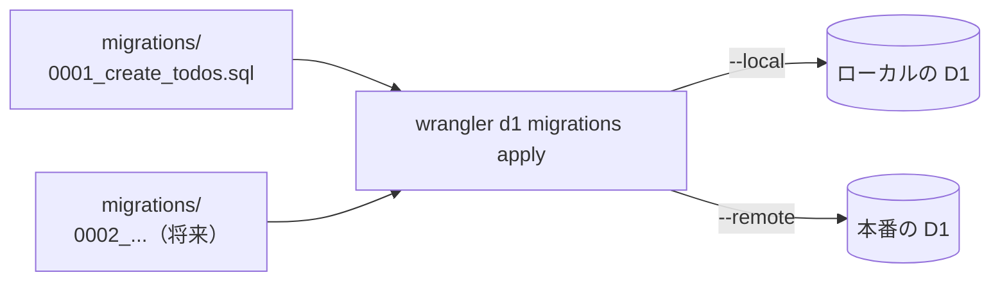

# 07. データベース設計 — todos テーブルとマイグレーション

D1（SQLite）にタスクをどう保存するかを決める。フェーズ1 のデータモデル（[03](./03-data-model.md)）が土台。

## 1. テーブル定義

テーブルは `todos` の1つだけ。`Todo` 型（[03](./03-data-model.md) §2）と 1:1 に対応させる。

```sql
CREATE TABLE todos (
  id TEXT PRIMARY KEY,
  title TEXT NOT NULL,
  completed INTEGER NOT NULL DEFAULT 0
);
```

| 列          | 型                           | 対応する `Todo` の項目 | 補足                                      |
| ----------- | ---------------------------- | ---------------------- | ----------------------------------------- |
| `id`        | `TEXT PRIMARY KEY`           | `id: string`           | 主キー（同じ id は2件入らない）           |
| `title`     | `TEXT NOT NULL`              | `title: string`        | `NOT NULL` で「値なし」をDB側でも禁止     |
| `completed` | `INTEGER NOT NULL DEFAULT 0` | `completed: boolean`   | SQLite に boolean 型がないため 0/1 で表す |

設計の決めごと：

| 項目             | 決めたこと                          | 理由                                                                                                         |
| ---------------- | ----------------------------------- | ------------------------------------------------------------------------------------------------------------ |
| `completed` の型 | `INTEGER` の 0（未完了）/ 1（完了） | SQLite には boolean 型が存在しない。0/1 で表すのが SQLite の標準的なやり方                                   |
| `created_at` 等  | 持たない                            | 現在の要件（[01](./01-requirements.md)）に作成日時を使う機能がない。`Todo` 型と 1:1 を保ち、過剰設計を避ける |
| 一覧の並び順     | `ORDER BY rowid`（追加順）          | SQLite が各行に自動で振る内部連番 `rowid` を使えば、列を足さずに「追加した順」で取り出せる                   |

## 2. Todo 型との対応（境界での変換）

DB の行は `completed` が 0/1 なので、そのままでは `Todo` 型（`completed: boolean`）にならない。**行 → `Todo` への変換はサーバー側の1か所で行い**、フロントには常に `Todo` の形で返す。

```ts
// DB の行を Todo 型へ変換（サーバー側の1か所に置く）
const toTodo = (row: { id: string; title: string; completed: number }): Todo => ({
  id: row.id,
  title: row.title,
  completed: row.completed === 1,
});
```

また、**`id` の採番はフロントからサーバーへ移す**（サーバー側の `crypto.randomUUID()` を使う。Workers でも同じ標準 API が使える）。

- フェーズ1：フロントが採番 → localStorage に保存（データの持ち主がブラウザだったので自然）
- フェーズ2：**データの持ち主は D1（サーバー側）**。採番の責任も持ち主に揃える。フロントは `title` を送るだけでよく、勝手な id を押し付けられない

`Todo` 型そのものは変更しない。front / server の両方から `src/shared/types.ts` を参照する（[05](./05-directory-and-steps.md) §1）。

## 3. マイグレーション

**マイグレーション**とは、テーブル定義の変更を SQL ファイルの積み重ねで管理する仕組み。「いつ・どんな定義変更をしたか」が履歴として残り、どの環境（ローカル・テスト・本番）にも同じ手順で反映できる。



- **置き場所**：リポジトリ直下の `migrations/`。ファイルは番号順（`0001_...` → `0002_...`）に、未適用のものだけが適用される
- **作成**：`wrangler d1 migrations create todo-app-db create_todos` で空の SQL ファイルが生成されるので、そこに §1 の `CREATE TABLE` を書く
- **適用**：`wrangler d1 migrations apply todo-app-db --local`（ローカル）／ `--remote`（本番）

D1 を使うには `wrangler.jsonc` に **binding**（Worker のコードから D1 を参照するための名前）を登録する。

```jsonc
{
  "d1_databases": [
    {
      "binding": "DB", // コードからは env.DB でアクセスする
      "database_name": "todo-app-db",
      "database_id": "<wrangler d1 create の出力>",
    },
  ],
}
```

**注意**：`wrangler.jsonc` の bindings を変更したら `vp run types` を実行して `worker-configuration.d.ts` を再生成し、コミットする（`env.DB` の型が生成され、TypeScript が binding の存在を知れる）。

## 4. テストでの D1

バックエンドのテスト（`test/worker/`）は Workers ランタイム上で動き、**テスト実行中だけの一時的な D1** が使える。ただしテーブルは自動では作られないため、テスト開始前にマイグレーションを適用する仕掛けが要る。

やることは3つ：

1. **`vitest.workers.config.ts`**：`@cloudflare/vitest-pool-workers` の `readD1Migrations("migrations")` で SQL ファイル群を読み、`miniflare.bindings.TEST_MIGRATIONS` としてテスト環境に渡す。あわせて `test.setupFiles` に下記②を登録する
2. **`test/worker/apply-migrations.ts`**（セットアップファイル）：`cloudflare:test` の `applyD1Migrations(env.DB, env.TEST_MIGRATIONS)` を呼び、各テストファイルの実行前にテーブルを作る
3. **`test/worker/env.d.ts`**：`ProvidedEnv` を拡張し、テストコード内の `env.DB` と `env.TEST_MIGRATIONS` に型を付ける

テスト同士の独立性は、各テストの前に `DELETE FROM todos` で全行を消して担保する（`beforeEach`）。「前のテストが入れたデータが残って結果が変わる」事故を防ぐためで、明示的に消す方が仕組みが目に見えて分かりやすい。

## まとめ

- テーブルは `todos` の1つ。列は `id` / `title` / `completed` で `Todo` 型と 1:1
- `completed` は SQLite に boolean がないため 0/1 の `INTEGER`。**行 → `Todo` の変換はサーバーの1か所**で行う
- `id` の採番はサーバー側 `crypto.randomUUID()` に移す（データの持ち主が採番する）
- テーブル定義は `migrations/` の SQL ファイルで管理し、`wrangler d1 migrations apply` で各環境に反映する
- bindings 変更後は `vp run types` を忘れない
- テストでは `readD1Migrations` + `applyD1Migrations` でテーブルを作り、`beforeEach` の全行削除で独立性を保つ
