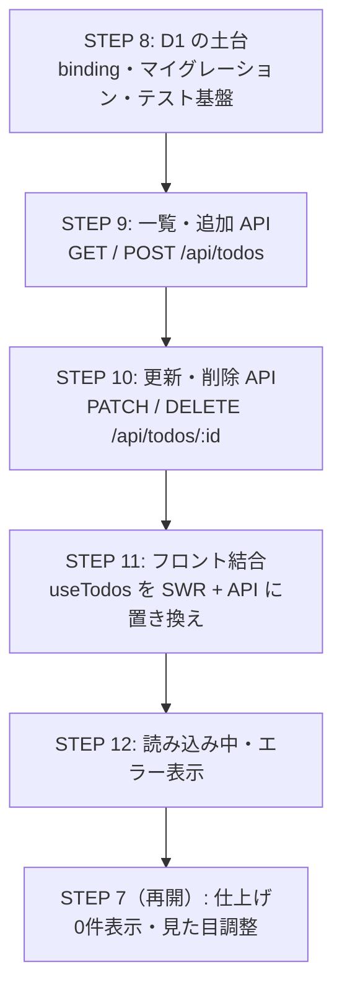

# 09. バックエンドの実装ステップ

フェーズ2（[06](./06-backend-architecture.md)〜[08](./08-api-design.md) の設計）を、どの順番で実装するかを決める。

## 1. 進め方

フェーズ1 と同じく **1 STEP = 1 Issue = 1 ブランチ = 1 PR**（[notes/開発の進め方.md](../notes/開発の進め方.md)）。番号は **STEP 8 から**始める。STEP 7（仕上げ）は番号を残したまま後回しにしてあり、フェーズ2 完了後に実施する（[05](./05-directory-and-steps.md) §4）。

順番の考え方は「**土台 → API → フロント結合**」。下から積み上げれば、各 STEP の終わりに必ず動く状態で区切れる。

- 先に **DB の土台**（STEP 8）を作らないと API が書けない
- API は **読み取り・作成**（STEP 9）→ **更新・削除**（STEP 10）の順。まず GET/POST が動けば curl で目に見えて確認できる
- サーバーが全部できてから **フロントを結合**（STEP 11）し、最後に **非同期ならではの表示**（STEP 12）を足す

## 2. ディレクトリ構成の変化

フェーズ2 で増える・変わるファイル：

```
todo-app/
├── migrations/
│   └── 0001_create_todos.sql        ← 新規（STEP 8）テーブル定義
├── src/
│   ├── front/hooks/useTodos.ts      ← 中身を置き換え（STEP 11）localStorage → SWR
│   └── server/routes/todos.ts       ← 新規（STEP 9〜10）Todo API
├── test/worker/
│   ├── apply-migrations.ts          ← 新規（STEP 8）テスト前にマイグレーション適用
│   ├── env.d.ts                     ← 新規（STEP 8）テスト用の型定義
│   └── todos.test.ts                ← 新規（STEP 9〜10）Todo API のテスト
├── package.json                     ← 変更（STEP 11）swr を依存に追加
├── vitest.workers.config.ts         ← 変更（STEP 8）マイグレーションの注入
└── wrangler.jsonc                   ← 変更（STEP 8）d1_databases の binding 追加
```

## 3. 実装ステップ



| STEP | ブランチ名                        | やること                                                                                                                                                                                                                                                                                                                                                                                     | 併せて書くテスト                                                                                                                                                                                                                                                           | 対応設計                              |
| ---- | --------------------------------- | -------------------------------------------------------------------------------------------------------------------------------------------------------------------------------------------------------------------------------------------------------------------------------------------------------------------------------------------------------------------------------------------- | -------------------------------------------------------------------------------------------------------------------------------------------------------------------------------------------------------------------------------------------------------------------------- | ------------------------------------- |
| 8    | `chore/step8-d1-setup`            | `wrangler d1 create todo-app-db` → `wrangler.jsonc` に `d1_databases`（binding `DB`）を追加 → `migrations/0001_create_todos.sql` を作成し `apply --local` → `vp run types`。テスト基盤（マイグレーション注入・`apply-migrations.ts`・`env.d.ts`）も整える                                                                                                                                    | `env.DB` の `todos` テーブルに INSERT → SELECT できる（テーブルが存在することの確認）                                                                                                                                                                                      | [07](./07-db-schema.md)               |
| 9    | `feat/step9-todos-read-create`    | `src/server/routes/todos.ts` に GET / POST を実装（`health.ts` と同じ流儀で `index.ts` に `.route()`）。`title` の手書きバリデーション                                                                                                                                                                                                                                                       | 空の状態で GET が `[]`／POST が `201`（ボディなし）を返す／POST 後の GET に追加したタスクが反映される（`id` はサーバー採番の UUID・`completed` は `false`）／空文字・空白のみの `title` は `400`／JSON でないボディは `400`                                                | [08](./08-api-design.md) §3           |
| 10   | `feat/step10-todos-update-delete` | PATCH / DELETE を実装（対象が存在したかは UPDATE / DELETE の変更行数で判定し、0件なら `404`）                                                                                                                                                                                                                                                                                                | PATCH が `204` を返し、`completed` の反転・`title` の編集が GET に反映される／空文字は `400`／`title`・`completed` の両方とも未指定は `400`／存在しない `id` は `404`／DELETE が `204` で一覧から消える／存在しない `id` の DELETE は `404`                                | [08](./08-api-design.md) §3           |
| 11   | `feat/step11-connect-api`         | `swr` を依存に追加し、`useTodos` の中身を localStorage → SWR に置き換える。一覧は `useSWR("/api/todos")` で取得し、追加・更新・削除は API を呼んだあと `mutate` で一覧を再取得する（[08](./08-api-design.md) §1）。**公開 API（`todos` / `addTodo` / `toggleTodo` / `deleteTodo` / `editTodo`）は変えない**ため、コンポーネントは無変更。localStorage のコードとフロント側の `id` 採番を削除 | `useTodos.test.ts` を fetch のモック（偽物）を使う形に書き直す（SWR も内部では `fetch` を呼ぶのでモックの方法は同じ。テスト間で SWR のキャッシュが共有されないようリセットに注意）。`App.test.tsx` などフロントの既存テストにもモック対応が必要（影響範囲を Issue に明記） | [06](./06-backend-architecture.md) §4 |
| 12   | `feat/step12-loading-error`       | SWR が返す `isLoading` / `error` を `useTodos` から公開し、`App` で「読み込み中…」「読み込みに失敗しました」を表示                                                                                                                                                                                                                                                                           | 読み込み中の表示が出る／fetch 失敗時にエラーメッセージが出る／成功時は一覧が出る                                                                                                                                                                                           | [06](./06-backend-architecture.md) §4 |

各 STEP の終わりに `vp check`・`vp test`・`vp run test:worker` を通し、`vp dev` でブラウザ確認する（[05](./05-directory-and-steps.md) §5）。

本番デプロイ（Cloudflare への公開）は STEP には含めない。main へのマージで GitHub Actions が自動的にデプロイする（[10](./10-ci-cd.md) §4。手動の手順は notes/ のデプロイ手順メモ）。**main へのマージ = 即本番公開**なので、動かない状態のコードを main に入れない。

## 4. 完成チェックリスト

フェーズ2 の完了条件。[01 の機能要件](./01-requirements.md#3-機能要件) がサーバー保存でも成り立つことを確認する。

- [ ] 追加・一覧・完了チェック・削除・編集の5機能が `vp dev` 上で動く（F-1〜F-5）
- [ ] 再読み込みしてもタスクが残る（保存先が D1 になっている）
- [ ] 別のブラウザ（またはシークレットウィンドウ）で開いても同じ一覧が見える
- [ ] curl で空文字の `title` を POST すると `400` が返る（サーバー側でも守られている）
- [ ] 読み込み中・エラー時の表示が出る
- [ ] `vp check`・`vp test`・`vp run test:worker` がすべて通る

## まとめ

- 順番は「**土台（STEP 8）→ API（STEP 9〜10）→ フロント結合（STEP 11〜12）**」。各 STEP が動く状態で終わる
- STEP 11 は `useTodos` の中身を SWR に置き換えるだけ。**公開 API を変えないので、コンポーネントは1行も触らない**のが答え合わせ
- 読み込み中・エラー表示（STEP 12）は SWR 化と分けて、1 PR 1 論点を保つ
- フェーズ2 が終わったら STEP 7（仕上げ）に戻る。デプロイは main へのマージで自動実行される（→ [10](./10-ci-cd.md)）
