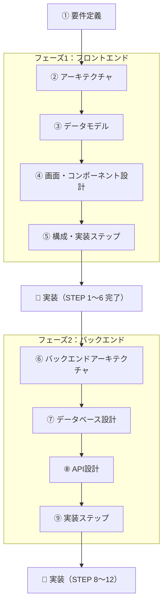

# TODOアプリ 設計ドキュメント

シンプルなTODOアプリの設計書。

## 概要

- **やること**：タスクを追加・一覧表示・完了チェック・削除・編集できる
- 開発は2つのフェーズに分けて進める

| フェーズ      | 内容                                   | 保存先                     | 技術                           | 状態      |
| ------------- | -------------------------------------- | -------------------------- | ------------------------------ | --------- |
| **フェーズ1** | フロントエンドを作り切る               | ブラウザ内（localStorage） | React 19 + TypeScript + Vite+  | ✅ 完了   |
| **フェーズ2** | バックエンドを作り、フロントと結合する | サーバー側（D1 = SQLite）  | Hono + Cloudflare Workers + D1 | 🚧 着手中 |

- 認証はスコープ外

## ドキュメント一覧

| #   | ファイル                                                   | フェーズ | 決めること                                           |
| --- | ---------------------------------------------------------- | -------- | ---------------------------------------------------- |
| 1   | [01-requirements.md](./01-requirements.md)                 | 共通     | 要件定義（作るもの／作らないもの／機能・非機能要件） |
| 2   | [02-architecture.md](./02-architecture.md)                 | 1        | アーキテクチャ（全体構成とデータの流れ）             |
| 3   | [03-data-model.md](./03-data-model.md)                     | 1        | データモデル（タスクのデータ構造と永続化）           |
| 4   | [04-ui-and-components.md](./04-ui-and-components.md)       | 1        | 画面設計とコンポーネント設計                         |
| 5   | [05-directory-and-steps.md](./05-directory-and-steps.md)   | 1        | ディレクトリ構成と実装ステップ                       |
| 6   | [06-backend-architecture.md](./06-backend-architecture.md) | 2        | バックエンドアーキテクチャ（Workers + Hono + D1）    |
| 7   | [07-db-schema.md](./07-db-schema.md)                       | 2        | データベース設計（todos テーブルとマイグレーション） |
| 8   | [08-api-design.md](./08-api-design.md)                     | 2        | API設計（エンドポイントとエラー処理）                |
| 9   | [09-backend-steps.md](./09-backend-steps.md)               | 2        | バックエンドの実装ステップ（STEP 8〜12）             |
| 10  | [10-ci-cd.md](./10-ci-cd.md)                               | 共通     | CI/CD（GitHub Actions での自動検証・自動デプロイ）   |

## 設計の進め方

フェーズ2 もフェーズ1 と同じ流れ（アーキテクチャ → データ → インターフェース → 実装ステップ）で設計する。

