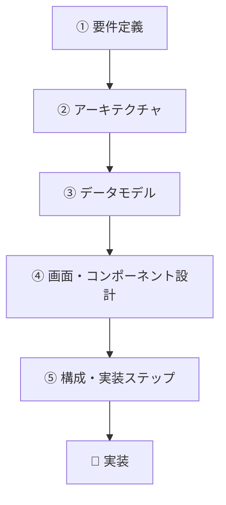

# TODOアプリ 設計ドキュメント

ブラウザだけで動く、シンプルなTODOアプリの設計書。

## 概要

- **やること**：タスクを追加・一覧表示・完了チェック・削除・編集できる
- **保存先**：ブラウザ内（localStorage）／サーバー・DB連携は次フェーズ
- **技術**：React 19 + TypeScript + Vite+
- 認証は今回のスコープ外

## ドキュメント一覧

| #   | ファイル                                                 | 決めること                                           |
| --- | -------------------------------------------------------- | ---------------------------------------------------- |
| 1   | [01-requirements.md](./01-requirements.md)               | 要件定義（作るもの／作らないもの／機能・非機能要件） |
| 2   | [02-architecture.md](./02-architecture.md)               | アーキテクチャ（全体構成とデータの流れ）             |
| 3   | [03-data-model.md](./03-data-model.md)                   | データモデル（タスクのデータ構造と永続化）           |
| 4   | [04-ui-and-components.md](./04-ui-and-components.md)     | 画面設計とコンポーネント設計                         |
| 5   | [05-directory-and-steps.md](./05-directory-and-steps.md) | ディレクトリ構成と実装ステップ                       |

## 設計の進め方

